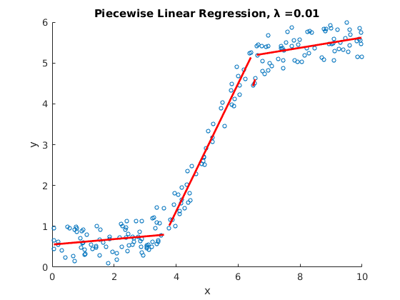

# Piecewise Linear Regression

A piecewise linear regression algorithm implemented in MATLAB. It uses dynamic programming to find the set of line segments with the lowest cost (sum of squared errors + λ &times; number of line segments).

## How it works

1. Sort the points by _x_-coordinate.
2. Calculate the regression parameters _(b0, b1)_ and sum of squared errors for every combination of leftmost and rightmost points.
3. For _k_ from 1 to the number of points, find the subsolution with the lowest cost.
4. Work backwards to find the combination of line segments with the lowest cost.

## Example output

## Copyright Information

Copyright &copy; 2017 Aidan Fitzgerald, GPL 3.0.
